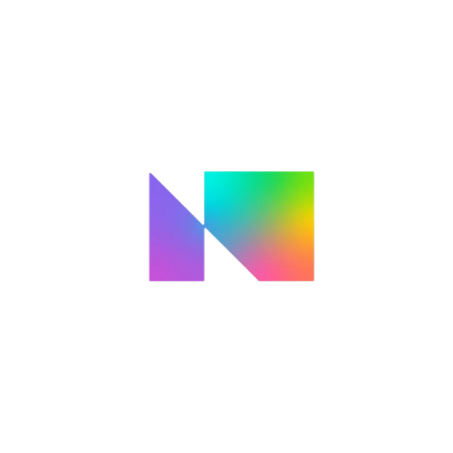
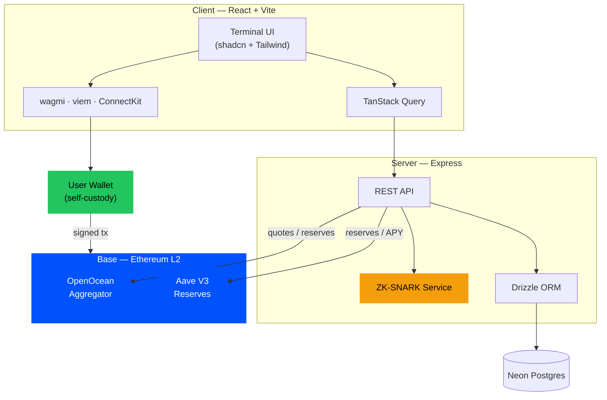
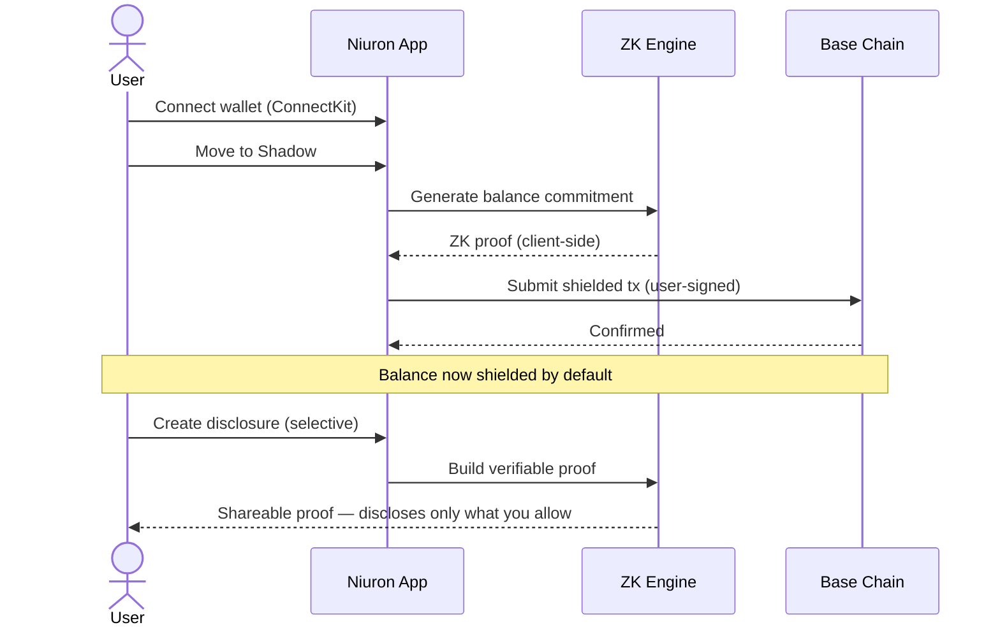
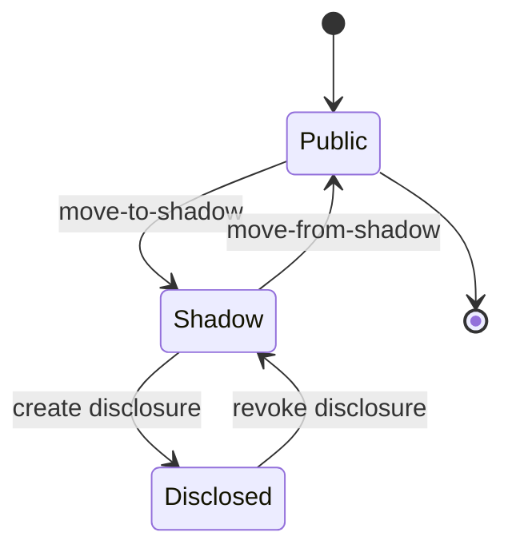
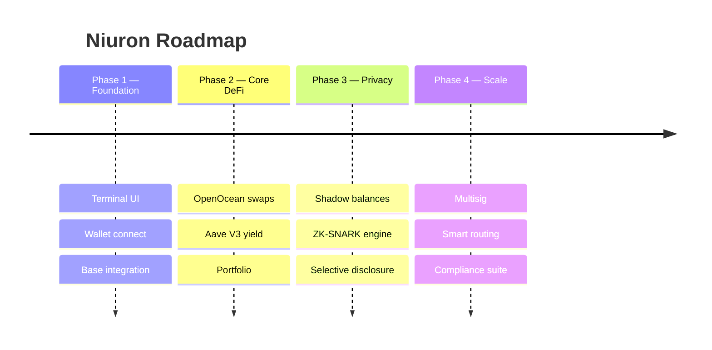

<div align="center">



# NIURON

### `Confidential finance, executed quietly.`

**A beta privacy-first DeFi terminal on Base — swap, earn, and pay with selective-disclosure workflows under active development.**

<br/>

[](https://base.org)
[](#-license)
[](#-security)
[](#-roadmap)

<br/>

[**Launch App**](#-quick-start) &nbsp;·&nbsp; [**Docs**](#-documentation) &nbsp;·&nbsp; [**Integrations**](#-integrations) &nbsp;·&nbsp; [**Roadmap**](#-roadmap) &nbsp;·&nbsp; [**Community**](#-community--socials)

</div>

---

## ▍Table of Contents

<table>
  <tr>
    <td width="33%" valign="top">

`01` &nbsp; [Overview](#-overview)
`02` &nbsp; [Key Features](#-key-features)
`03` &nbsp; [Tech Stack](#-tech-stack)
`04` &nbsp; [Integrations](#-integrations)
`05` &nbsp; [Architecture](#-architecture)

</td>
    <td width="33%" valign="top">

`06` &nbsp; [Privacy Flow](#-privacy-flow)
`07` &nbsp; [Quick Start](#-quick-start)
`08` &nbsp; [Project Structure](#-project-structure)
`09` &nbsp; [API Reference](#-api-reference)
`10` &nbsp; [Roadmap](#-roadmap)

</td>
    <td width="33%" valign="top">

`11` &nbsp; [Security](#-security)
`12` &nbsp; [Community & Socials](#-community--socials)
`13` &nbsp; [License](#-license)

<br/>

[](#niuron)

</td>
  </tr>
</table>

---

## ▍Overview

**Niuron** is a non-custodial, privacy-focused DeFi dashboard built on **Base** (an Ethereum L2). It is building a confidentiality layer around Base DeFi workflows and selective disclosure. OpenOcean and Aave paths are being integrated progressively, while ZK-heavy flows currently use simulator-backed commitments until production proving infrastructure is complete.

> **Beta status:** you hold the keys and sign wallet transactions; privacy/proof modules are still under active hardening and should not be treated as audited production privacy.

<div align="center">

| Privacy | Performance | Built On | Custody |
|:---:|:---:|:---:|:---:|
| Selective disclosure WIP | ~2s Base blocks | Base ecosystem | 100% self-custody target |

</div>

---

## ▍Key Features

| Module | Description |
|---|---|
| **Dashboard** | Unified terminal view of public + shadow balances, activity, and batched actions. |
| **Private Swaps** | OpenOcean quote + wallet-signing flow under active integration. |
| **Yield** | Aave V3 reserve discovery and strategy tracking under active integration. |
| **Stealth / Shadow Balances** | Simulator-backed shielded accounting while production privacy rails are built. |
| **Selective Disclosure** | Generate verifiable proofs to disclose balances on demand. |
| **ZK-SNARK Engine** | snarkjs/circuit workflow scaffold plus simulator-backed proof endpoints. |
| **Multisig** | Coordinate multi-signature actions. |
| **Smart Routing** | Optimized transaction routing across protocols. |
| **Analytics** | PnL, volume, trade history, and activity breakdowns. |
| **Compliance** | Configurable rules + exportable audit trail. |

---

## ▍Tech Stack

<div align="center">

[](https://react.dev)
[](https://www.typescriptlang.org)
[](https://vitejs.dev)
[](https://tailwindcss.com)
[](https://expressjs.com)
[](https://orm.drizzle.team)
[](https://neon.tech)
[](https://tanstack.com/query)

</div>

**Frontend:** React 18 · Vite · wouter (routing) · TailwindCSS + shadcn/ui · framer-motion · recharts · TanStack Query
**Web3:** wagmi · viem · ConnectKit · Base
**Backend:** Express · Drizzle ORM · Neon PostgreSQL · WebSockets

---

## ▍Integrations

> Click any badge to open the integration's site.

### Chain & Wallet

[](https://base.org)
[](https://wagmi.sh)
[](https://viem.sh)
[](https://docs.family.co/connectkit)

### DeFi Protocols

[](https://openocean.finance)
[](https://aave.com)

### Infrastructure

[](https://neon.tech)
[](https://orm.drizzle.team)

<div align="center">

| Integration | Role | Status |
|---|---|:---:|
| **Base** | Settlement layer (Ethereum L2) | `BETA` |
| **wagmi / viem** | Contract reads, writes, signing | `BETA` |
| **ConnectKit** | Wallet connection UX | `BETA` |
| **OpenOcean** | DEX aggregation for swaps | `WIP` |
| **Aave V3** | Lending / yield reserves | `WIP` |
| **Neon Postgres** | App data & audit storage | `BETA` |
| **ZK-SNARK Engine** | Privacy proofs | `SIMULATOR / WIP` |

</div>

---

## ▍Architecture



---

## ▍Privacy Flow

How funds move between **public** and **shadow** states, with selective disclosure:





---

## ▍Quick Start

> **Prerequisites:** Node.js 20+, a Base-compatible wallet, and a PostgreSQL connection string.

```bash
# 1) Install dependencies
npm install

# 2) Configure environment
cp .env.example .env   # then fill in the values below

# 3) Push the database schema
npm run db:push

# 4) Run the dev server
npm run dev
```

App runs at **`http://localhost:5000`** by default.

### Environment Variables

| Variable | Description |
|---|---|
| `DATABASE_URL` | Neon/PostgreSQL connection string |
| `SESSION_SECRET` | Secret for session signing |

### Scripts

| Command | Action |
|---|---|
| `npm run dev` | Start dev server (client + API) |
| `npm run build` | Production build |
| `npm run start` | Run the production build |
| `npm run check` | TypeScript type-check |
| `npm run db:push` | Sync Drizzle schema to the database |

---

## ▍Project Structure

```text
niuron/
├── client/                 # React + Vite frontend
│   ├── public/             # Static assets (logos, favicon)
│   └── src/
│       ├── components/     # UI, terminal shell, wallet, shields
│       ├── pages/          # dashboard, swap, yield, stealth, zksnark …
│       └── index.css       # "Terminal Floor" design tokens
├── server/                 # Express API
│   ├── routes.ts           # REST endpoints
│   ├── zksnark-service.ts  # ZK proof generation
│   ├── yield-protocols.ts  # Aave V3 integration
│   └── db.ts               # Drizzle + Neon
├── shared/
│   └── schema.ts           # Drizzle schema (shared types)
└── README.md
```

---

## ▍API Reference

<details>
<summary><b>Portfolio</b></summary>

| Method | Endpoint | Description |
|---|---|---|
| `GET` | `/api/portfolio/stats` | Total + shadow value |
| `GET` | `/api/portfolio/holdings` | Token holdings |
| `GET` | `/api/portfolio/positions` | Open positions |

</details>

<details>
<summary><b>Shadow Balances</b></summary>

| Method | Endpoint | Description |
|---|---|---|
| `GET` | `/api/shadow-balances` | List shielded balances |
| `POST` | `/api/shadow-balances/move-to-shadow` | Shield funds |
| `POST` | `/api/shadow-balances/move-from-shadow` | Unshield funds |

</details>

<details>
<summary><b>Swap (OpenOcean)</b></summary>

| Method | Endpoint | Description |
|---|---|---|
| `GET` | `/api/swap/quote` | Get best quote |
| `POST` | `/api/swap/transaction` | Build swap tx |
| `POST` | `/api/swap/send` | Broadcast swap |
| `GET` | `/api/swap/orders` | Order history |

</details>

<details>
<summary><b>Yield (Aave V3)</b></summary>

| Method | Endpoint | Description |
|---|---|---|
| `GET` | `/api/yield/aave/reserves` | Aave reserves |
| `GET` | `/api/yield/protocols` | Supported protocols |
| `GET` | `/api/yield/strategies` | Strategies |

</details>

<details>
<summary><b>ZK & Disclosure</b></summary>

| Method | Endpoint | Description |
|---|---|---|
| `POST` | `/api/zk/generate/balance` | Generate balance proof |
| `GET` | `/api/disclosure/proofs` | List disclosures |
| `POST` | `/api/disclosure/create` | Create disclosure |
| `POST` | `/api/disclosure/revoke/:id` | Revoke disclosure |

</details>

<details>
<summary><b>Compliance & Analytics</b></summary>

| Method | Endpoint | Description |
|---|---|---|
| `GET` | `/api/compliance/rules` | List rules |
| `GET` | `/api/audit/export` | Export audit trail |
| `GET` | `/api/analytics/pnl` | Profit & loss |
| `GET` | `/api/analytics/volume` | Volume stats |

</details>

---

## ▍Roadmap



| Phase | Milestone | Status |
|---|---|:---:|
| 1 | Foundation & wallet | `LIVE` |
| 2 | Core DeFi (swap + yield) | `LIVE` |
| 3 | Privacy layer (ZK) | `IN PROGRESS` |
| 4 | Scale (multisig, routing) | `PLANNED` |

---

## ▍Security

- **Non-custodial** — you control your keys; every transaction is user-signed.
- **Proven protocols** — built on audited, battle-tested Aave V3 + OpenOcean liquidity.
- **Client-side proofs** — ZK proofs generated locally; minimal data leaves your device.
- **Private by default** — balances are shielded unless you choose to disclose.

> **Disclaimer:** Niuron is experimental software provided "as is", without warranty. DeFi carries financial risk. Always do your own research and never invest more than you can afford to lose.

---

## ▍Community & Socials

<div align="center">

[](https://twitter.com)
[](https://discord.com)
[](https://telegram.org)
[](https://github.com)
[](#-documentation)

</div>

> Replace the links above with your official channels.

### Documentation

In-app docs are available at **`/docs`** and the whitepaper at **`/whitepaper`** when running the app.

---

## ▍License

Released under the **MIT License**. See [`LICENSE`](LICENSE) for details.

<div align="center">
<br/>


**Built with privacy in mind · Beta on Base**

`> niuron --connect --private`

</div>
